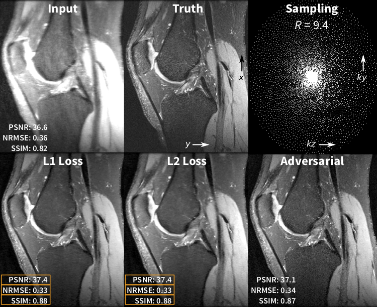

# Compressed Sensing: From Research to Clinical Practice with Data-Driven Learning

## Introduction

Compressed sensing for MRI allows for high subsampling factors while maintaining high image quality. The result is shortened scan durations and/or improved resolutions. Further, compressed sensing increases the diagnostic information from each scan performed. Overall, compressed sensing has significant clinical impact in increasing imaging exams in diagnostic quality and in improving patient experience. However, a number of challenges exist when moving compressed sensing from research to the clinic. These challenges include hand-crafted image priors, sensitive tuning parameters, and long reconstruction times. Data-driven learning provides a compelling solution to address these challenges. As a result, compressed sensing can have maximal clinical impact. The purpose here is to demonstrate an example data-driven reconstruction algorithm using deep convolutional neural networks.



**_Figure 1: Example results of a volumetric knee dataset that is subsampled with an acceleration factor R of 9.4 with corner cutting._** *In the bottom row, the volume was reconstructed slice by slice using three networks trained with different loss functions. The reconstruction using the network trained using the L1 and L2 losses yielded the best results in terms of PSNR, NRMSE, and SSIM. However, the reconstruction using the network trained with the adversarial loss yielded results with most realistic texture.*

## Setup

This project uses the open source python toolbox `sigpy` for generating sampling masks, estimating sensitivity maps, and other MRI specific operations. The functionality of `sigpy` can be replaced with the `bart` toolbox. Note that if the `bart` binary is in the system paths, `bart` will be used to estimate sensitivity maps using Uecker et al's [ESPIRiT](https://www.ncbi.nlm.nih.gov/pubmed/23649942) algorithm. Otherwise, sensitivity maps will be estimated with `sigpy` using Ying and Sheng's [JSENSE](https://www.ncbi.nlm.nih.gov/pubmed/17534910).

Install the required python packages (tested with python 3.6 on Ubuntu 16.04LTS):

```bash
pip install -r requirements.txt
pip install pyfftw # optional for faster fft's
```

Fully sampled datasets can be downloaded from <http://mridata.org> using the python script and text file.

```bash
python3 data_prep.py --verbose mridata_org.txt
```

The download and pre-processing will take some time! This script will create a `data` folder with the following sub-folders:

* `raw/ismrmrd`: Contains files with ISMRMRD files directly from <http://mridata.org>
* `raw/npy`: Contains the data converted to numpy format, [npy](https://www.numpy.org/devdocs/reference/generated/numpy.lib.format.html)
* `tfrecord/train`: Training examples converted to TFRecords
* `tfrecord/validate`: Validation examples converted to TFRecords
* `tfrecord/test`: Test examples converted to TFRecords
* `test_npy`: Sub-sampled volumetric test examples in `npy` format
* `masks`: Sampling masks generated using `sigpy` in `npy` format

All TFRecords contain fully sampled raw k-space data and sensitivity maps.

## Training

The training can be performed using the following command.

```bash
python3 --model_dir summary/model recon_train.py
```

All the parameters (dimensions and etc) assume that the training is performed with the knee datasets from mridata.org. See the `--help` flag for more information on how to adjust the training for new datasets.

For convenience, the training can be performed using the bash script: `train_all.sh`. This script will train the reconstruction network with a number of different losses: L1, L2, and L1+Adversarial.

## Inference

For file input `kspace_input.npy`, the data can be reconstructed with the following command. The test data in `data/test_npy` can be used to test the inference script.

```bash
python3 recon_run.py summary/model kspace_input.npy kspace_output.npy
```

## References

1. Ong F, Amin S, Vasanawala SS, Lustig M. [An Open Archive for Sharing MRI Raw Data.](http://mridata.org/) In: ISMRM & ESMRMB Joint Annual Meeting. Paris, France; 2018. p. 3425.
1. Ong F, Lustig M. [SigPy: A Python Package for High Performance Iterative Reconstruction.](https://github.com/mikgroup/sigpy) In: ISMRM Annual Meeting & Exhibition. Montreal, Canada; 2019.
1. Uecker et al. [BART Toolbox for Computational Magnetic Resonance Imaging](https://github.com/mrirecon/bart), DOI: 10.5281/zenodo.592960
1. Cheng JY, Chen F, Alley MT, Pauly JM, Vasanawala SS. Highly Scalable Image Reconstruction using Deep Neural Networks with Bandpass Filtering. [arXiv:1805.03300 [cs.CV].](https://arxiv.org/abs/1805.03300) 2018 May 8.
